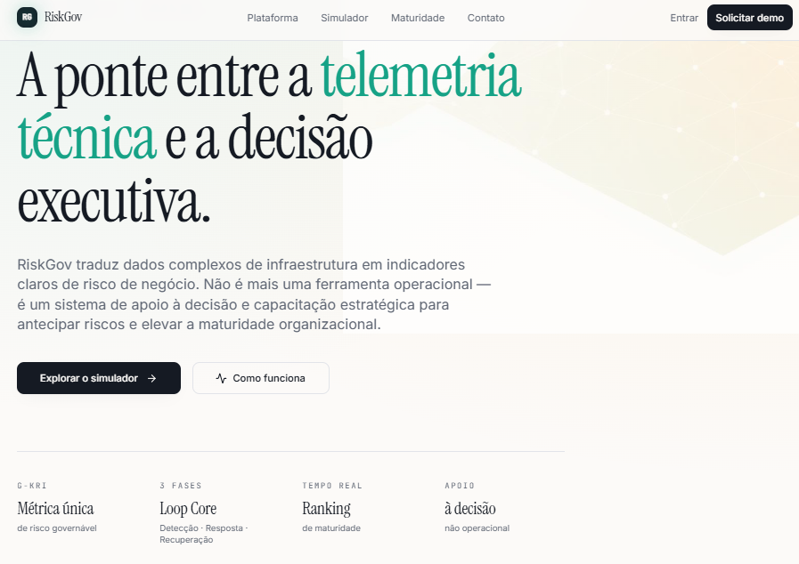
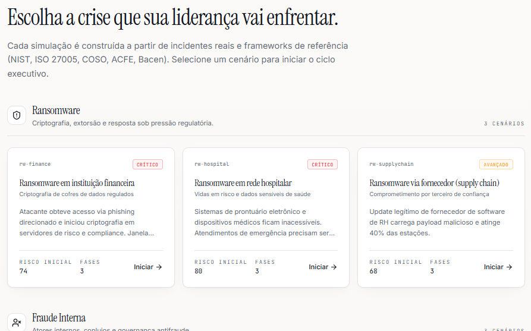
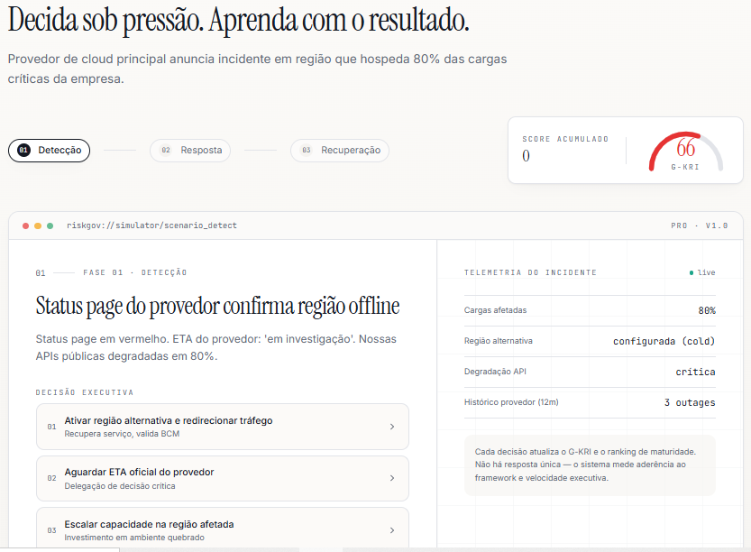
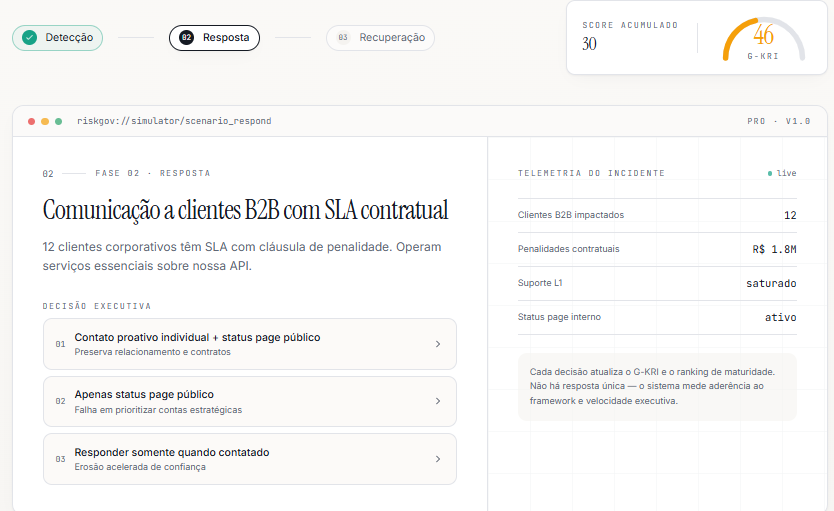

# Protótipo — RiskGov / Risk Bridge Maker

## 1. Identificação

O RiskGov possui um protótipo web desenvolvido para demonstrar a proposta de simulação e análise de riscos.

A aplicação é apresentada sob a identificação **Risk Bridge Maker**.

O protótipo foi desenvolvido como parte da demonstração do projeto RiskGov e representa a camada visual e interativa disponibilizada para apresentação da proposta.

---

## 2. Aplicação

**Página principal:**

https://risk-bridge-maker.lovable.app/

A página principal representa o ponto de acesso à aplicação web do protótipo.

---

## 3. Módulo de Simulação

**Simulador:**

https://risk-bridge-maker.lovable.app/simulador

O endereço `/simulador` corresponde ao ambiente destinado à experiência de simulação de cenários de risco.

A existência dessa interface constitui evidência da disponibilização de um protótipo web voltado à demonstração da proposta de simulação do RiskGov.

---

## 4. Finalidade do Protótipo

O protótipo tem como finalidade demonstrar a experiência de interação com o conceito do RiskGov, especialmente:

- simulação de cenários de risco;
- análise de situações de crise;
- tomada de decisão durante uma simulação;
- apresentação de informações relacionadas ao risco;
- apoio à interpretação dos resultados.

Esses elementos devem ser considerados conforme sua disponibilidade efetiva na versão publicada do protótipo.

---

## 5. Natureza da Evidência

A existência do protótipo comprova a disponibilidade de uma aplicação web acessível para demonstração.

Entretanto, a existência e hospedagem do protótipo, isoladamente, não comprovam a existência de uma plataforma corporativa em produção.

Portanto, o protótipo não deve ser utilizado como evidência isolada de:

- operação em ambiente produtivo;
- monitoramento real de infraestrutura corporativa;
- integração com infraestrutura corporativa;
- integração real com Jira, GLPI ou ServiceNow;
- arquitetura cloud corporativa;
- SLA de disponibilidade de 99,5%;
- certificação ISO;
- previsão de risco por inteligência artificial;
- resposta automática a incidentes;
- operação contínua em ambiente corporativo.

Esses aspectos somente devem ser classificados como implementados quando existirem evidências técnicas correspondentes.

---

## 6. Evidências Visuais

O protótipo possui capturas de tela armazenadas no diretório:

```text
assets/
└── screenshots/
    ├── 01-tela-inicial.png
    ├── 02-tela-simulador.png
    ├── 03-cenario-decisao.png
    └── 04-cenario-decisao2.png
```
As capturas constituem evidências visuais da interface disponibilizada pelo protótipo Risk Bridge Maker.

### 6.1 Tela Inicial

**Arquivo:**

`assets/screenshots/01-tela-inicial.png`



A captura registra a tela inicial da aplicação e sua identificação visual.

Essa evidência sustenta a existência e a apresentação da aplicação web utilizada como protótipo do RiskGov.

### 6.2 Tela do Simulador

**Arquivo:**

`assets/screenshots/02-tela-simulador.png`



A captura registra a interface do módulo de simulação.

Essa evidência sustenta a disponibilidade de uma interface destinada à experiência de simulação de cenários.

### 6.3 Cenário de Decisão

**Arquivo:**

`assets/screenshots/03-cenario-decisao.png`



A captura registra uma etapa do fluxo de simulação relacionada à análise do cenário e à tomada de decisão pelo participante.

Essa evidência demonstra visualmente a representação de uma situação de decisão no protótipo.

### 6.4 Segunda Etapa do Cenário de Decisão

**Arquivo:**

`assets/screenshots/04-cenario-decisao2.png`



A captura registra uma segunda etapa do fluxo de decisão apresentado pelo protótipo.

Essa evidência complementa a captura anterior e permite documentar a continuidade da experiência de simulação.
### 6.5 Limitação das Evidências Visuais

As capturas de tela comprovam os elementos visualmente observáveis nas respectivas interfaces.

Isoladamente, elas não comprovam:

- implementação de serviços de backend;
- persistência de dados;
- integração com sistemas corporativos;
- monitoramento de infraestrutura;
- arquitetura cloud corporativa;
- inteligência artificial preditiva;
- resposta automática a incidentes;
- disponibilidade em ambiente produtivo;
- SLA de disponibilidade;
- certificação ou conformidade formal.

Esses aspectos permanecem sujeitos às demais evidências técnicas do projeto.
